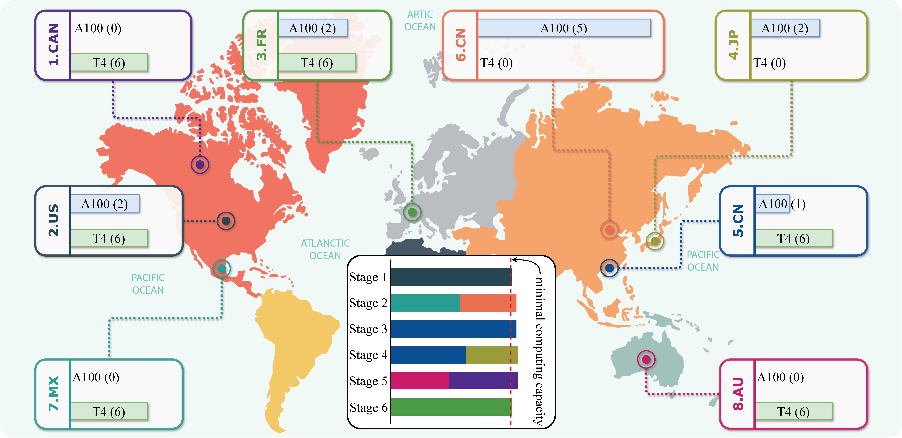
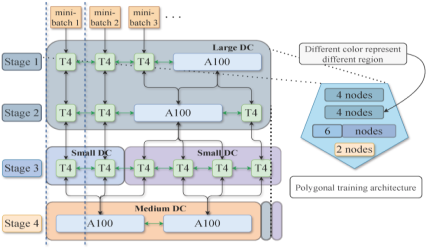

# Polygon Training Architecture for Foundation Model on Dual-Heterogeneous with Network and Device


Large language models have experienced rapid growth, constrained by the computational limits of training foundation models. With the continuous release of new GPU products, high-end devices are increasingly accessible, eventually transitioning into the mid-range and low-end segments. A pivotal focus in current research is the facilitation of joint training across diverse regions and devices. However, this research encounters dual-heterogeneous challenges in both network and device capabilities. 

## 💡Overview 

- We introduce a novel polygonal training architecture for foundation model, designed to support large-scale training paradigms. Our approach incorporates critical factors such as model size, network conditions, and device performance from both global and local perspectives.

- We develop the lightweight polygon initialization algorithm, which considers data centers as the fundamental units from a global perspective. This algorithm assesses computing power, latency, and bandwidth between units to establish an initial training strategy that incorporates both pipeline and data parallelism. 

- We address the complexities introduced by varying combinations of heterogeneous devices and network conditions, which lead to intricate communication scenarios. We design a polygonal local optimization algorithm, which is a precise search strategy. By accurately evaluating communication costs during model training across diverse heterogeneous configurations, we identify an efficient parallel architecture, enabling enhanced collaborative training across devices with fine granularity.


## 🤖Models

- We chose the GPT architecture and divided the model into different scales of 1.2 billion, 1.8 billion, and 2.6 billion parameters, divided by 24, 36, and 48 Transformer layers respectively.

- You can view the specific GPT network architecture from the modules folder or from huggingface and modelscope


## 💻Environments

### Download our code

```shell
git clone https://github.com/nsccsuperli/PTAFM.git
```

### Install PyTorch env
```shell
pip3 install torch==1.9.0+cu111 torchtext -f https://download.pytorch.org/whl/torch_stable.html
pip3 install cupy-cuda110==8.6.0
```

### Prepare dataset
Download glue-qqp dataset for throughput benchmark.

### Use the provided Docker environment (Optional, coming soon) 
Comming soon...

### Use TC scripts to control network delay and bandwidth

You need to prepare different types of devices in advance. In this paper, we used NVIDIA A100 and T4 devices. Meanwhile, you need to set the latency and bandwidth in advance according to different regions and inject them into different nodes.

- Set the latency and bandwidth parameters in the [ghtc.py](scheduler\ghtc.py). 
- Launch the script and set the latency & bandwidth across devices.
    ```shell
    bash aws_start_heter_tc.sh
    bash aws_generate_heter_tc.sh
    ```

## 📌Foundation Model Training


### Group all nodes based on multiple factors using our lightweight initialization algorithm

```shell
cd ./ACO
python ACO_CVRP.py
```
- [ACO_CVRP.py](ACO\ACO_CVRP.py) required parameters: `NUM_STAGE`,`POWER_SECTION`,`LATENCY_SECTION`,`BANDWIDTH_SECTION`
- For details, please refer to [data-center-config.txt](./ACO/data-center-config.txt).
- Generate multiple groups, and [ACO_Solutions.py](./ACO/ACO_Solutions.py) will present the grouped information.

### Use search algorithms to find the optimal strategy 

```shell
cd ./GA
python main.py
```
- Generate the final pipeline parallel and data parallel groups

### More importantly, Communication optimization mechanism
Please refer to [comm](./comm) directory
Based on the algorithm-generated group mappings from the prior step, configure the following parameters in [comm_utils.py](comm\comm_utils.py) : `pipeline_config`, `data_parallel_config`

### 🚀Run script


- From each terminal, run cmd:
    ```      
    python dist_runner.py --dist-url tcp://XXX.XXX.XXX.XXX:9000 --world-size N --rank i (i=0,...,N-1)
    ```
### 🚀Run with Advanced Scripts (recommended)

- Go to the [scripts](./scripts) directory
- First update the public IPs and private IP of the rank-0 node in [ip_list.sh](scripts\ip_list.sh).
- Edit the following parameters in the [aws_run_gpt3_optimal_Ngpu_training.sh](scripts\aws_run_gpt3_optimal_Ngpu_training.sh): `rank_map`,`rank_mapping_id`,`nodes_per_node`
- Edit the following parameters in the [aws_run_batch_gpt3_optimal.sh](scripts\aws_run_batch_gpt3_optimal.sh): `num_layers`,`batch_size`
- Run the [training script](scripts\aws_run_batch_gpt3_optimal.sh) and initiate model training.
    ```shell
    bash scripts\aws_run_gpt3_optimal_Ngpu_training.sh 1
    ```
- Training logs and execution records will be shown in [trace_json](trace_json).

## 🧡 Acknowledgements

We sincerely appreciate the contributions of the following methods
>[DTFM](https://github.com/DS3Lab/DT-FM)
